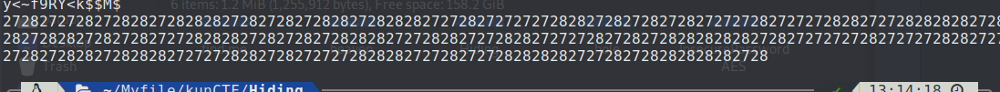
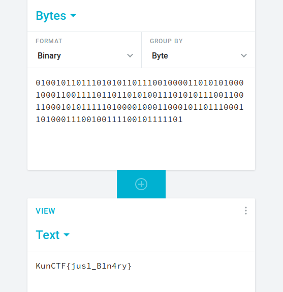

## Hiding
```
strings Hiding.jpg| awk 'length($0) > 10'
```



Convert '27' '28'  -> '0' '1'

01001011011101010110111001000011010101000100011001111011011010100111010101110011001100010101111101000010001100010110111000110100011100100111100101111101


Goto https://cryptii.com/pipes/binary-decoder



KunCTF{jus1_B1n4ry}