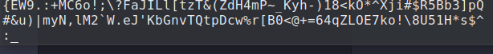
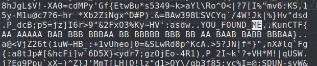
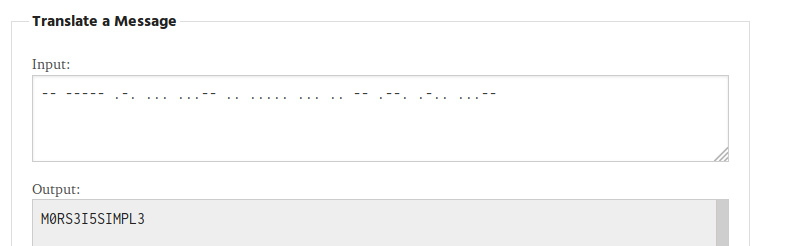

## Find Me

```
$ strings find.me|less 
```

```
:/ME
```


Convert AB to .-  => Morse

-- ----- .-. ... ...-- .. ..... ... .. -- .--. .-.. ...--

go to https://morsecode.world/international/translator.html




KunCTF{M0RS3I5SIMPL3}