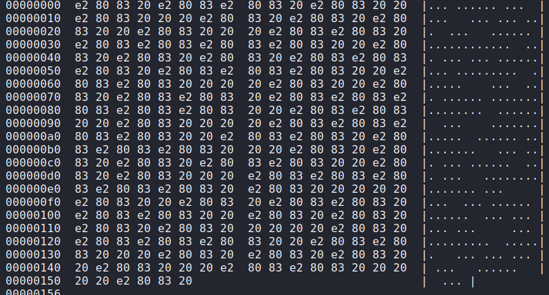
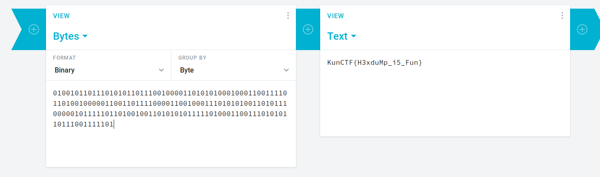

## Pattern

```
$ hexdump -C blank.txt
```



Change the 'e28083' -> '0'  & '20' -> '1':

We have: 01001011011101010110111001000011010101000100011001111011010010000011001101111000011001000111010101001101011100000101111101101001001101010101111101000110011101010110111001111101

Convert it from binary



KunCTF{H3xduMp_i5_Fun}
